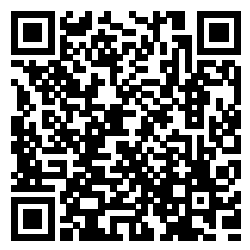

# ShadowRocket ADBlock Rules

Forked from [https://github.com/h2y/Shadowrocket-ADBlock-Rules](https://github.com/h2y/Shadowrocket-ADBlock-Rules).

License: [CC BY-SA 4.0](LICENSE)

原规则停止更新，考虑实际使用时还是有些细微需要调整的地方，Fork 了一份自己维护。

此仓库只会维护原规则中 **sr_top500_whitelist_ad.conf** 规则，其他规则不维护。

## 规则说明

此仓库维护的规则是【白名单过滤+广告过滤】，白名单中包含了 top500 网站中可直连的境外网站、中国网站，其余所有境外网站默认代理，此规则还包含了广告过滤功能。

广告过滤只会根据域名、IP进行屏蔽，如果广告内容是域名下的某些文件，则不会进行过滤（避免直接屏蔽域名）。

## 规则地址

https://git.io/JTVPY

